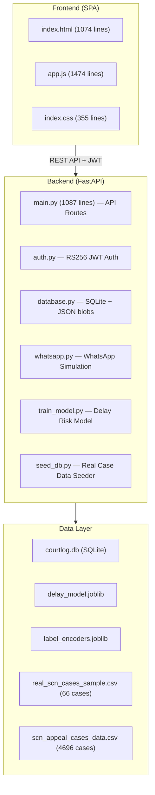

# COURTLOG 2.0 — Full Project Analysis

> **Historical snapshot — superseded as of 1 October 2026.** File paths, line counts, deployment/data/model statuses, and implementation claims below predate current code review. Use [`COURTLOG_FULL_AUDIT.md`](COURTLOG_FULL_AUDIT.md), [`COURTLOG_COMPLETION_PLAN.md`](COURTLOG_COMPLETION_PLAN.md), [`DEVELOPMENT_PROGRESS.md`](DEVELOPMENT_PROGRESS.md), and [`README.md`](README.md) for current status. Institutional-review/proposal assertions are retained from earlier project notes and were not independently verified in this development pass; confirm documentary evidence before external use. The delay-model rows are generated synthetic data, while legacy database/seed files must remain read-only and are not authorized for real-case testing.

## What It Is
**COURTLOG** is a case-tracking platform built for **Nigerian courts** (targeting the **Federal High Court**), designed for the **COUCH 2026** competition (Public Sector / e-Governance track + Best AI Innovation Award). It follows a case from filing to post-judgment enforcement, complementing (not competing with) the court's existing e-filing system.

> [!IMPORTANT]
> The project has real institutional backing — the concept was reviewed by the **Deputy Chief Registrar of the Federal High Court (Barrister Antonia Oyibo)**, and a formal proposal has been submitted to the Chief Registrar's office.

---

## Architecture

---

## Tech Stack

| Layer | Technology |
|-------|-----------|
| **Frontend** | HTML5, Vanilla JS, Tailwind CSS (CDN), Chart.js, FontAwesome, Google Fonts (Outfit + Plus Jakarta Sans) |
| **Backend** | FastAPI, Pydantic, Uvicorn |
| **Auth** | RS256 JWT (auto-generated key pair), OAuth2 Bearer tokens |
| **Database** | SQLite (cases & users stored as JSON blobs), fallback from Firebase |
| **ML** | Scikit-Learn Logistic Regression, Joblib, Pandas, NumPy |
| **Messaging** | WhatsApp Business API simulation (self-hosted webhook) |
| **Passwords** | bcrypt hashing |

---

## Four Core Modules

### Module 1: QR Chain of Custody
- Physical case files tracked via QR scan events at checkpoints (filing, registry, courtroom)
- Flags files unscanned for 7+ days as `custody_alert`
- Endpoints: `POST /api/scan`, `POST /api/cases/{id}/report-missing`

### Module 2: Hearing Compliance Engine
- Clerks log call-over outcomes (Heard / Adjourned) in one action
- **5th Adjournment Hard Block** — ACJA/ACJL Section 396 compliance: blocks further adjournments at count ≥ 4 unless DCR overrides
- WhatsApp notification broadcast on adjournment
- Endpoints: `POST /api/cases/{id}/hearings`, `POST /api/cases/{id}/dcr-override`

### Module 3: Delay-Risk Prediction (AI Layer)
- Logistic Regression model trained on: case_type, court, adjournment_count, days_since_filing
- Binary classification: High risk (stalled) vs. normal
- Falls back to heuristic scoring if model not loaded
- Endpoints: `POST /api/cases/{id}/predict`

### Module 4: Execution Tracker
- Post-judgment enforcement monitoring
- Generates Writ of Fi Fa and Garnishee instruments
- Logs sheriff enforcement actions
- Flags non-compliant matters (no enforcement after 90 days)
- Endpoints: `POST /api/cases/{id}/execution`, `GET /api/export/njc`

---

## 5-Level RBAC Hierarchy

| Level | Role | Username / Password | Permissions |
|-------|------|-------------------|-------------|
| 1 | **Sheriff** | `sheriff` / `123` | QR scan, report missing files, execution actions |
| 2 | **Clerk** | `clerk` / `123` | Case creation, hearing logging, document upload, QR scan |
| 3 | **DCR** | `dcr` / `123` | Division supervision, 5th adjournment override, case reassignment, weekly reports |
| 4 | **Chief Registrar** | `cr` / `12345` | Full admin — user management, judge assignment, NJC export, all actions |
| 5 | **Judge** | `judge` / `123` | Read-only docket, deliver rulings only, case alerts |

---

## Key API Endpoints

| Endpoint | Method | Purpose |
|----------|--------|---------|
| `/api/login` | POST | JWT authentication |
| `/api/refresh` | POST | Token refresh |
| `/api/cases` | GET/POST | List/create cases |
| `/api/cases/{id}` | GET | Single case detail |
| `/api/scan` | POST | QR chain of custody scan |
| `/api/cases/{id}/hearings` | POST | Log hearing outcome |
| `/api/cases/{id}/dcr-override` | POST | DCR 5th adjournment override |
| `/api/cases/{id}/predict` | POST | On-demand delay prediction |
| `/api/cases/{id}/execution` | POST | Log enforcement action |
| `/api/cases/{id}/assign-judge` | POST | CR: judge assignment |
| `/api/cases/{id}/reassign` | POST | DCR/CR: reassign case |
| `/api/cases/{id}/report-missing` | POST | Sheriff: report missing file |
| `/api/cases/{id}/documents` | POST | Upload document metadata |
| `/api/cases/{id}/alerts` | GET | Case-specific alerts |
| `/api/judge/alerts` | GET | Judge docket alerts |
| `/api/export/njc` | GET | NJC monthly compliance report |
| `/api/export/dcr-weekly` | GET | DCR weekly division report |
| `/api/cron` | POST | Manual compliance sweep |
| `/api/whatsapp/webhook-simulator` | POST | Simulated WhatsApp webhook |
| `/api/whatsapp/logs` | GET | WhatsApp broadcast history |
| `/api/users` | GET/POST/DELETE | User management |
| `/` | GET | Serves frontend SPA |

---

## Frontend Structure
- **Dark mode + Light mode** theming with CSS custom properties
- **Glassmorphism** aesthetic with backdrop blur panels
- **8 tabs**: Overview, QR Chain of Custody, Clerk Call-Over Logger, DCR Division Hub, Judge's Docket, Execution & Writs, User Management, WhatsApp Activity
- Role-based tab visibility (e.g., DCR console hidden from Sheriff)
- Interactive role switcher in the header for demo purposes
- Chart.js for delay risk distribution visualization
- Toast notification system
- Print-friendly Writ of Fi Fa modal

---

## Data Seeding
- [seed_db.py](file:///c:/Users/VAR/Documents/couch project/backend/seed_db.py) loads **66 real cases** from NigeriaLII/LawPavilion CSV
- Enriches with distributions from **4,696 SCN appeal cases**
- Generates realistic hearing logs, scan events, execution logs
- Maps court codes (SC, CA, FHC) to full names
- Classifies case types (Criminal, Election Petition, Land/Property, Commercial, etc.)

---

## Key Design Decisions
1. **SQLite over Firebase** — simplified local deployment, stores JSON blobs in SQLite tables
2. **WhatsApp over SMS** — per DCR feedback, registries already use WhatsApp groups
3. **Complement to e-filing** — positioned alongside, not competing with, existing court systems
4. **Heuristic fallback** — if ML model isn't loaded, delay risk uses deterministic scoring
5. **In-memory WhatsApp logs** — simulation logs stored in-memory for dashboard display
6. **Auto-escalation** — 24-hour SLA on DCR approval; auto-escalates to Chief Registrar if unresolved

---

## Files Overview

| File | Purpose |
|------|---------|
| [main.py](file:///c:/Users/VAR/Documents/couch project/backend/main.py) | FastAPI app with all API routes (1087 lines) |
| [database.py](file:///c:/Users/VAR/Documents/couch project/backend/database.py) | SQLite database with JSON blob storage (317 lines) |
| [auth.py](file:///c:/Users/VAR/Documents/couch project/backend/auth.py) | RS256 JWT authentication (152 lines) |
| [whatsapp.py](file:///c:/Users/VAR/Documents/couch project/backend/whatsapp.py) | WhatsApp Business API simulation (87 lines) |
| [train_model.py](file:///c:/Users/VAR/Documents/couch project/backend/train_model.py) | ML model training script (73 lines) |
| [seed_db.py](file:///c:/Users/VAR/Documents/couch project/backend/seed_db.py) | Database seeder with real case data (352 lines) |
| [test_api.py](file:///c:/Users/VAR/Documents/couch project/backend/test_api.py) | API integration tests (273 lines) |
| [index.html](file:///c:/Users/VAR/Documents/couch project/frontend/index.html) | Frontend SPA (1074 lines) |
| [app.js](file:///c:/Users/VAR/Documents/couch project/frontend/app.js) | Frontend JS logic (1474 lines) |
| [index.css](file:///c:/Users/VAR/Documents/couch project/frontend/index.css) | Theming & styling (355 lines) |
| [requirements.txt](file:///c:/Users/VAR/Documents/couch project/requirements.txt) | Python dependencies (17 entries) |

